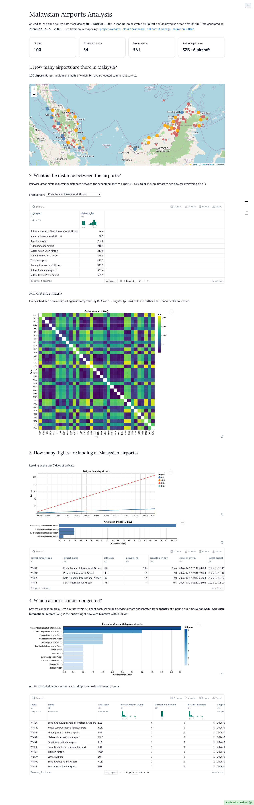
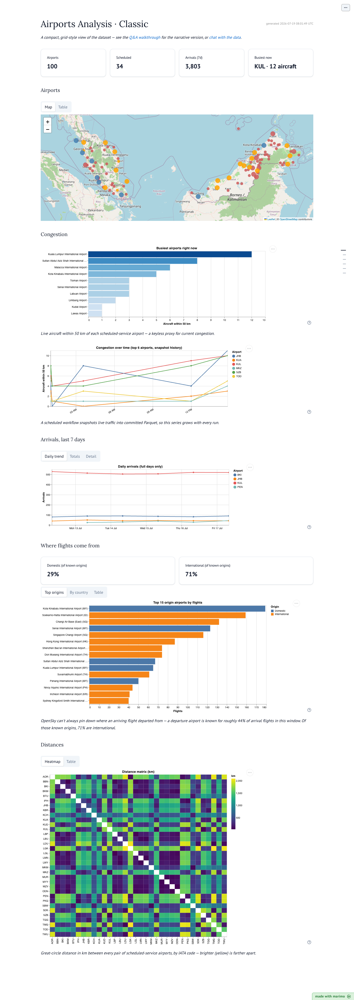
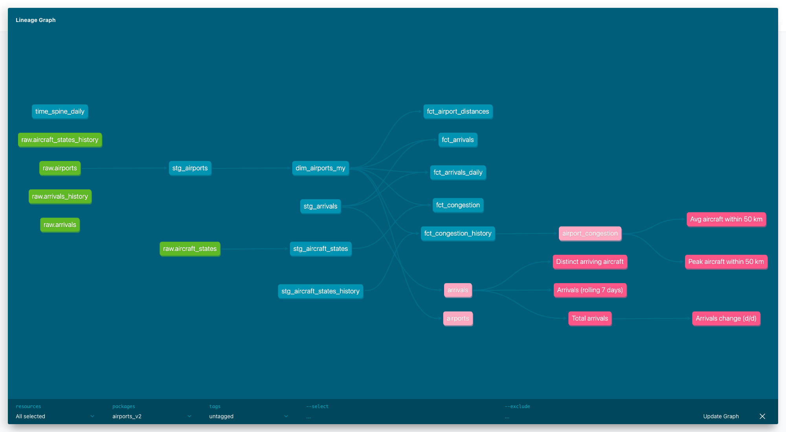
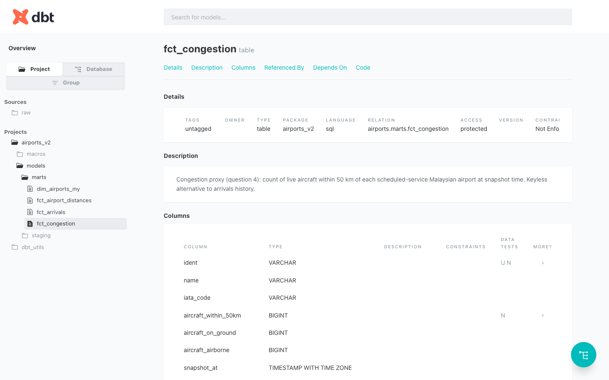
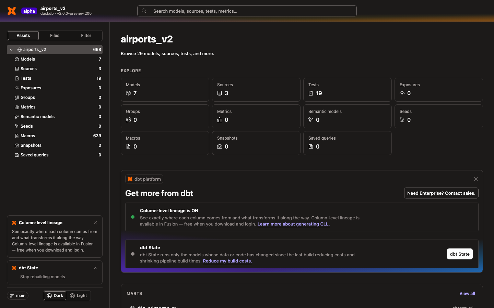
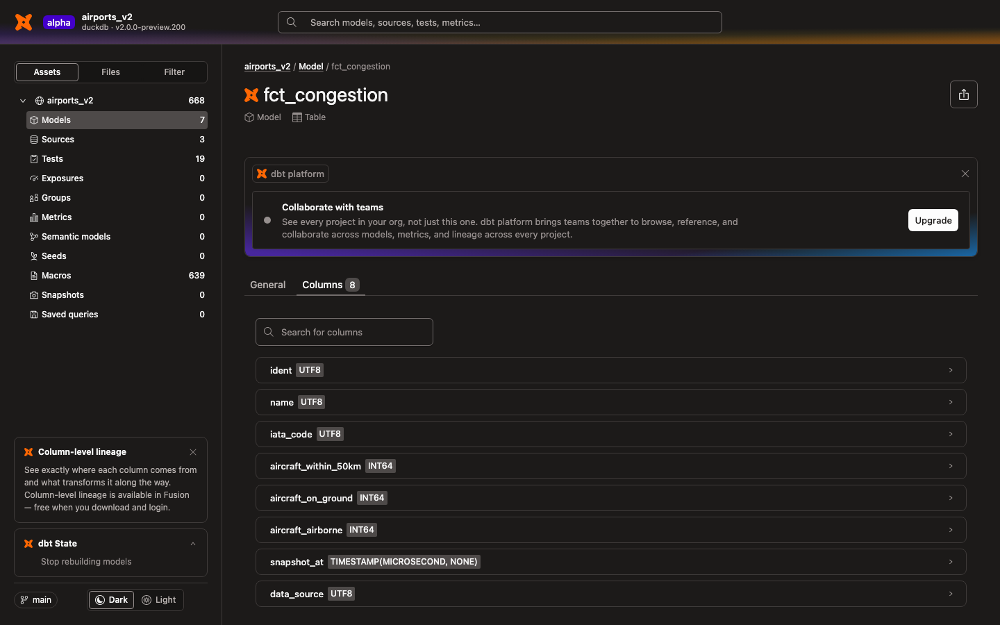
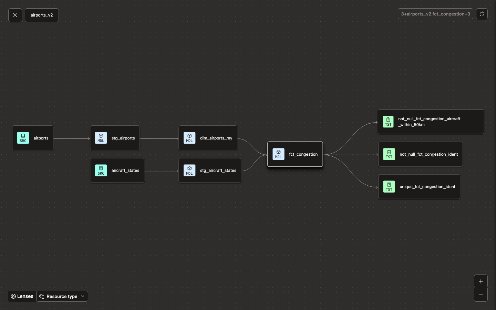
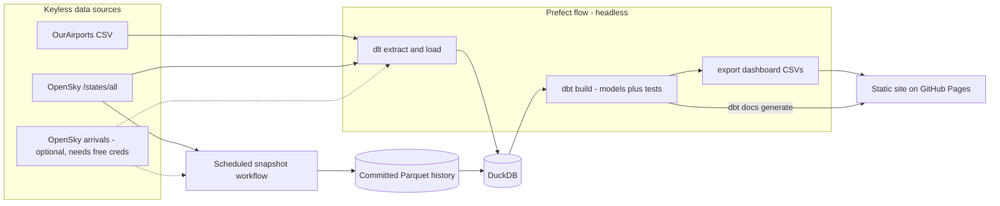
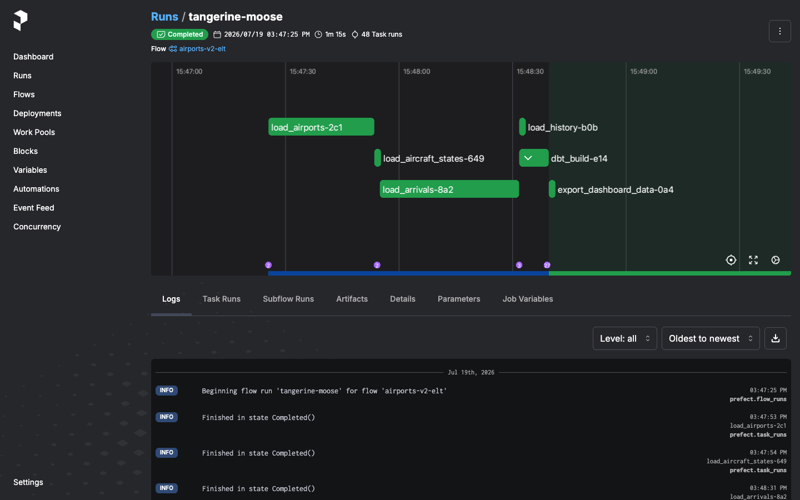
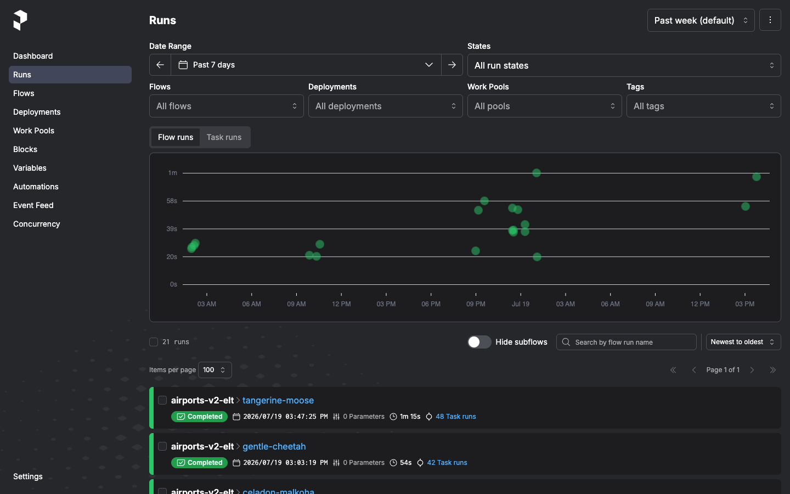

# Simple Airports Analysis v2 — Malaysia

[](https://github.com/1bk/simple-airports-analysis-v2/actions/workflows/ci.yml)
[](https://github.com/1bk/simple-airports-analysis-v2/actions/workflows/pages.yml)
[](https://github.com/1bk/simple-airports-analysis-v2/releases)


[](https://1bk.dev/simple-airports-analysis-v2/dashboard/)
[](https://1bk.dev/simple-airports-analysis-v2/classic/)
[](https://1bk.dev/simple-airports-analysis-v2/dbt-docs/)


**Live:** [Project overview](https://1bk.dev/simple-airports-analysis-v2/) ·
[Interactive dashboard](https://1bk.dev/simple-airports-analysis-v2/dashboard/) ·
[classic dashboard](https://1bk.dev/simple-airports-analysis-v2/classic/) ·
[dbt docs & lineage](https://1bk.dev/simple-airports-analysis-v2/dbt-docs/)

A revival of [simple-airports-analysis](https://github.com/1bk/simple-airports-analysis)
(2020) rebuilt on a modern, fully open-source data stack. Same questions, new tools:

1. How many airports are there in Malaysia?
2. What is the distance between the airports in Malaysia?
3. How many flights are landing at Malaysian airports?
4. Which airport is the most congested?

The result is a **static site** — an interactive [marimo](https://marimo.io) dashboard
(running entirely in your browser via WebAssembly) with browsable
[dbt docs](https://docs.getdbt.com/docs/build/documentation) and table lineage at
`/dbt-docs/` — deployed to GitHub Pages on every push to `main`. No servers anywhere.

## What changed since v1

| | v1 (2020) | v2 (2026) | Why |
|---|---|---|---|
| Warehouse | Postgres (Docker) | [DuckDB](https://duckdb.org) | Zero infra, single file, no Docker |
| Extract/Load | Hand-rolled Python + scraping | [dlt](https://dlthub.com) | Declarative, schema-inferring EL |
| Orchestration | Luigi | [Prefect 3](https://prefect.io) | Runs headless as plain Python; dbt models surface as Prefect assets with lineage. (Prefect announced its acquisition of Dagster Labs in July 2026) |
| Transformation | dbt | dbt-core 1.12 + [dbt-duckdb](https://github.com/duckdb/dbt-duckdb) | Still the right tool |
| Dashboard | Metabase (Docker) | [marimo](https://marimo.io) | Notebook-as-code in git, exports to static WASM — the dashboard itself is hostable on GitHub Pages |
| Packaging | requirements.txt | [uv](https://docs.astral.sh/uv/) | Fast, lockfile-native |
| CI/CD | Travis CI | GitHub Actions | Lint + pipeline on every push; Pages deploy |

## Showcase


*The static WASM dashboard, covering the analysis questions in the browser — no server required
(arrivals lights up when OpenSky credentials are configured).*


*A [second, grid-style dashboard](https://1bk.dev/simple-airports-analysis-v2/classic/) that mirrors the
original v1 Metabase layout — stat cards, map, busyness scatter, arrivals chart, and distance matrix —
served alongside the Q&A version at `/classic/`.*


*Table lineage from raw sources through staging to the congestion mart, via dbt docs.*


*Column-level documentation and tests for `fct_congestion`, generated by dbt docs.*

### dbt Docs v2 (preview)

The hosted docs site above is the classic static dbt docs, which can be exported to
a single HTML file and served from anywhere. dbt Labs' next-gen **Docs v2** (built on
the new [dbt Fusion engine](https://docs.getdbt.com/docs/fusion/about-fusion), currently
alpha/beta) reads parquet artifacts and needs a running local server, so it isn't
static-hostable yet — it can't replace the deployed site. Run it locally with
`make docs-v2` (installs a sandboxed Fusion CLI on first use, see the Makefile comment
for the one-liner) to try the new UI against this project's models:


*The new Fusion-powered dbt Docs v2 UI, served locally via `make docs-v2`.*


*Asset-centric model page for `fct_congestion` — a searchable column list with types, alongside a description and test-results panel on the General tab, richer than classic docs' flat columns table.*


*The redesigned lineage graph (sources → staging → mart → tests) in fullscreen, with a "Lenses" control for filtering by resource type. Compiling with `--static-analysis strict --write-lineage` did produce column-level lineage data with no dbt-platform login required, but the interactive per-column trace in this UI is gated behind "download and login" to dbt platform — so the graph above shows table-level lineage only.*

## Architecture



- **Airports** come from the keyless [OurAirports](https://ourairports.com/data/) dataset.
- **Congestion** is a keyless proxy: a live snapshot of aircraft near each airport from
  OpenSky's anonymous API (fallbacks: [adsb.lol](https://api.adsb.lol), then a committed
  sample so the pipeline is always reproducible).
- **Arrivals** (question 3) need free OpenSky credentials for the live fetch. Without
  `OPENSKY_CLIENT_ID`/`OPENSKY_CLIENT_SECRET` set, the pipeline falls back to the
  committed snapshot history and degrades gracefully if that's missing too.
- **Snapshot history**: a [scheduled workflow](.github/workflows/snapshot.yml) (and
  `make snapshot` locally) merges each aircraft-state snapshot and 7-day arrivals window
  into deduplicated Parquet under `history/`, committed to the repo. Every deploy loads
  it into DuckDB, so congestion and arrivals are real time series that keep working even
  when OpenSky throttles CI runner IPs — last-known-good by construction.

### Orchestration (Prefect)

`make all` runs the whole ELT pipeline headless — no UI needed. To watch it run instead,
start the Prefect server in one terminal (`make ui`) and point the pipeline at it in
another: `PREFECT_API_URL=http://127.0.0.1:4200/api make pipeline`.


*A completed ELT flow run in the Prefect UI.*


*Pipeline runs tracked in the Prefect UI.*

## Quickstart

Requires [uv](https://docs.astral.sh/uv/) and `make`. No Docker, no databases to install.

```sh
make all        # uv sync + full pipeline: dlt -> DuckDB -> dbt build (+ tests)
make site       # build the static site into _site/ (dashboard + dbt docs)
python3 -m http.server --directory _site   # view it locally
```

Other targets: `make lint` (pre-commit: gitleaks, ruff, sqlfluff), `make snapshot`
(merge a fresh data snapshot into `history/`), `make clean`.

Optional: `cp .env.example .env` and fill in free OpenSky credentials to enable the
arrivals data — everything else works without it.

To develop the dashboard interactively: `uv run marimo edit dashboard/dashboard.py`.

## Project layout

```
pipelines/     dlt sources + Prefect flow (the entrypoint: python -m pipelines.flow)
dbt/           dbt project: staging views + marts, tests, docs
dashboard/     marimo notebook + public/ data baked for the WASM build
history/       committed Parquet time series, grown by the snapshot workflow
seeds/         committed sample aircraft snapshot (offline/CI fallback)
.github/       CI (lint + pipeline + site build) and Pages deploy workflows
```

## Future features

- **sqlmesh** as an alternative transformation engine alongside dbt
- **Semantic layer** (MetricFlow) over the marts
- **OpenSky arrivals** wired into CI via repository secrets
- **dbt Docs v2 hosting** once dbt Labs ships a static export (see the preview section above)
- **AI/LLM layer**: natural-language questions over the warehouse via the dbt MCP server

## Versioning & releases

The project follows [semantic versioning](https://semver.org): MAJOR bumps mean breaking
changes to the pipeline contract or data models, MINOR bumps add new models, sources, or
dashboard features, and PATCH bumps are fixes. The version lives in `pyproject.toml`.

Releases are cut by tagging:

```sh
git tag vX.Y.Z && git push origin vX.Y.Z
```

which triggers a GitHub Actions workflow that publishes a GitHub release using that
version's entry in [CHANGELOG.md](CHANGELOG.md) (written per
[Keep a Changelog](https://keepachangelog.com); the release fails if the entry is
missing, so notes can't be forgotten). `v2.0.0` is the first release of the v2 rewrite
(v1 being the original 2020 repo).

## Credits

Original assessment project: [1bk/simple-airports-analysis](https://github.com/1bk/simple-airports-analysis).
Airport data © [OurAirports](https://ourairports.com/data/) (public domain).
Live aircraft data from the [OpenSky Network](https://opensky-network.org) research API, with
[adsb.lol](https://adsb.lol) ([ODbL](https://opendatacommons.org/licenses/odbl/)-licensed ADS-B
data) as a fallback source.

MIT licensed.
