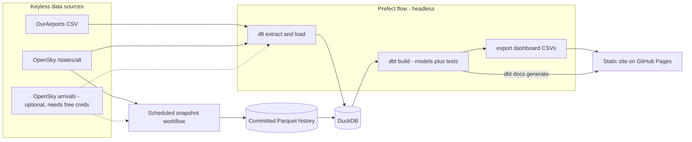
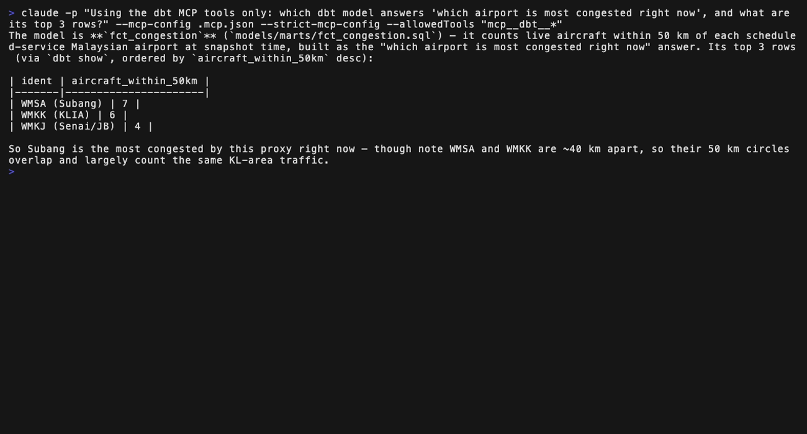
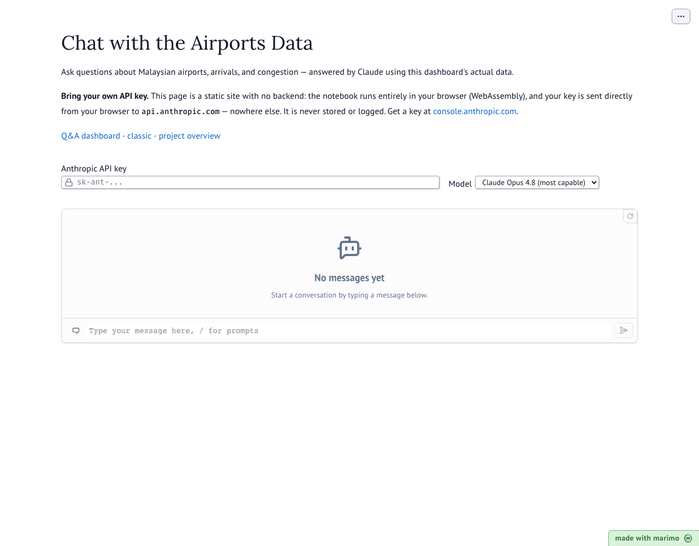

# Simple Airports Analysis v2 — Malaysia

[](https://github.com/1bk/simple-airports-analysis-v2/actions/workflows/ci.yml)
[](https://github.com/1bk/simple-airports-analysis-v2/actions/workflows/pages.yml)
[](https://github.com/1bk/simple-airports-analysis-v2/releases)


[](https://1bk.dev/simple-airports-analysis-v2/dashboard/)
[](https://1bk.dev/simple-airports-analysis-v2/classic/)
[](https://1bk.dev/simple-airports-analysis-v2/chat/)
[](https://1bk.dev/simple-airports-analysis-v2/dbt-docs/)


**Live:** [Project overview](https://1bk.dev/simple-airports-analysis-v2/) ·
[Interactive dashboard](https://1bk.dev/simple-airports-analysis-v2/dashboard/) ·
[classic dashboard](https://1bk.dev/simple-airports-analysis-v2/classic/) ·
[chat with the data](https://1bk.dev/simple-airports-analysis-v2/chat/) ·
[dbt docs & lineage](https://1bk.dev/simple-airports-analysis-v2/dbt-docs/)

A revival of [simple-airports-analysis](https://github.com/1bk/simple-airports-analysis)
(2020) rebuilt on a modern, fully open-source data stack. Same questions, new tools:

1. How many airports are there in Malaysia?
2. What is the distance between the airports in Malaysia?
3. How many flights are landing at Malaysian airports?
4. Which airport is the most congested?

The result is a **static site** — an interactive [marimo](https://marimo.io) dashboard
(running entirely in your browser via WebAssembly) with browsable
[dbt docs](https://docs.getdbt.com/docs/build/documentation) and table lineage at
`/dbt-docs/` — deployed to GitHub Pages on every push to `main`. No servers anywhere.

## What changed since v1

| | v1 (2020) | v2 (2026) | Why |
|---|---|---|---|
| Warehouse | Postgres (Docker) | [DuckDB](https://duckdb.org) | Zero infra, single file, no Docker |
| Extract/Load | Hand-rolled Python + scraping | [dlt](https://dlthub.com) | Declarative, schema-inferring EL |
| Orchestration | Luigi | [Prefect 3](https://prefect.io) | Runs headless as plain Python; dbt models surface as Prefect assets with lineage. (Prefect announced its acquisition of Dagster Labs in July 2026) |
| Transformation | dbt | dbt-core 1.12 + [dbt-duckdb](https://github.com/duckdb/dbt-duckdb) | Still the right tool |
| Dashboard | Metabase (Docker) | [marimo](https://marimo.io) | Notebook-as-code in git, exports to static WASM — the dashboard itself is hostable on GitHub Pages |
| Packaging | requirements.txt | [uv](https://docs.astral.sh/uv/) | Fast, lockfile-native |
| CI/CD | Travis CI | GitHub Actions | Lint + pipeline on every push; Pages deploy |

## Showcase


*The static WASM dashboard, covering the analysis questions in the browser — no server required
(arrivals lights up when OpenSky credentials are configured).*


*A [second, grid-style dashboard](https://1bk.dev/simple-airports-analysis-v2/classic/) that mirrors the
original v1 Metabase layout — stat cards, map, congestion charts, arrivals tabs, and distance
matrix — served alongside the Q&A version at `/classic/`.*


*The full lineage in the [hosted dbt docs](https://1bk.dev/simple-airports-analysis-v2/dbt-docs/):
raw sources (green) → staging → marts (blue) → and, in pink, the semantic layer — semantic
models and the metrics defined on top of them.*


*Column-level documentation and tests for `fct_congestion`, generated by dbt docs.*

### dbt Docs v2 (preview)

The hosted docs site above is the classic static dbt docs, which can be exported to
a single HTML file and served from anywhere. dbt Labs' next-gen **Docs v2** (built on
the new [dbt Fusion engine](https://docs.getdbt.com/docs/fusion/about-fusion), currently
alpha/beta) reads parquet artifacts and needs a running local server, so it isn't
static-hostable yet — it can't replace the deployed site. Run it locally with
`make docs-v2` (installs a sandboxed Fusion CLI on first use, see the Makefile comment
for the one-liner) to try the new UI against this project's models:


*The new Fusion-powered dbt Docs v2 UI, served locally via `make docs-v2`.*


*Asset-centric model page for `fct_congestion` — a searchable column list with types, alongside a description and test-results panel on the General tab, richer than classic docs' flat columns table.*


*The redesigned lineage graph (sources → staging → mart → tests) in fullscreen, with a "Lenses" control for filtering by resource type. Compiling with `--static-analysis strict --write-lineage` did produce column-level lineage data with no dbt-platform login required, but the interactive per-column trace in this UI is gated behind "download and login" to dbt platform — so the graph above shows table-level lineage only.*

## Architecture



- **Airports** come from the keyless [OurAirports](https://ourairports.com/data/) dataset.
- **Congestion** is a keyless proxy: a live snapshot of aircraft near each airport from
  OpenSky's anonymous API (fallbacks: [adsb.lol](https://api.adsb.lol), then a committed
  sample so the pipeline is always reproducible).
- **Arrivals** (question 3) need free OpenSky credentials for the live fetch. Without
  `OPENSKY_CLIENT_ID`/`OPENSKY_CLIENT_SECRET` set, the pipeline falls back to the
  committed snapshot history and degrades gracefully if that's missing too.
- **Snapshot history**: a [scheduled workflow](.github/workflows/snapshot.yml) (and
  `make snapshot` locally) merges each aircraft-state snapshot and 7-day arrivals window
  into deduplicated Parquet under `history/`, committed to the repo. Every deploy loads
  it into DuckDB, so congestion and arrivals are real time series that keep working even
  when OpenSky throttles CI runner IPs — last-known-good by construction.

### Semantic layer (MetricFlow)

New to semantic layers? The idea: instead of hand-writing a new SQL mart for every
question ("arrivals by airport", "arrivals by day", "arrivals by airport by week…"),
you define each **metric once** — its aggregation, its time column, how tables join —
and [MetricFlow](https://github.com/dbt-labs/metricflow) generates the SQL for any
slice on demand:


```sh
make metrics    # validate the semantic layer + run a demo query
make mf ARGS='query --metrics arrivals_rolling_7d --group-by metric_time'
make mf ARGS='query --metrics avg_airport_congestion --group-by airport__iata_code'
```

The definitions live in [`dbt/models/marts/_semantic.yml`](dbt/models/marts/_semantic.yml):
three semantic models (arrivals, airports, congestion history) joined through a shared
`airport` entity, and six metrics including a rolling 7-day cumulative and a
day-over-day derived metric — both computed against a
[time spine](dbt/models/marts/time_spine_daily.sql).

Two honest footnotes: the MetricFlow CLI runs sandboxed via `uvx` because it currently
pins `dbt-core < 1.12` (this project is on 1.12 — the semantic YAML uses the
backwards-compatible spec both understand), and MetricFlow is licensed
**BSL 1.1**, not an OSI-approved open-source license — free to use here, but flagged
since this project is otherwise FOSS-first.

#### Who consumes what

A fair question at this point: do the dashboards use these metrics? **No — and that's
by design, not an accident.** The hosted site is fully static, so nothing on it can run
a query engine; each surface gets its data differently:

| Surface | Reads | When the query runs |
|---|---|---|
| Q&A / classic dashboards | CSV extracts of the marts, baked at build time | Pipeline time |
| [Data chat](https://1bk.dev/simple-airports-analysis-v2/chat/) | The same CSV extracts, embedded in the model's prompt | Pipeline time |
| `make mf` (semantic layer) | The DuckDB warehouse directly — MetricFlow writes the SQL | The moment you ask |
| dbt MCP (AI clients) | The dbt project + DuckDB directly | The moment the AI asks |

The marts answer this project's four *fixed* questions, and the static site serves those
precomputed answers. The semantic layer and MCP are the two *ad-hoc* paths: they answer
questions nobody wrote SQL for — new groupings, new time windows — but they run against
the warehouse, so they're local-only (clone the repo, run `make all`, then ask). The
lineage graph in the [hosted dbt docs](https://1bk.dev/simple-airports-analysis-v2/dbt-docs/)
shows the split: everything up to the blue marts feeds the site; the pink semantic-layer
nodes hang off the same marts but are consumed on demand.

### AI layer (dbt MCP)

The repo ships with the official (Apache-2.0)
[dbt MCP server](https://github.com/dbt-labs/dbt-mcp) wired in, so an AI assistant
opened in this repo can explore lineage, compile models, and query the warehouse —
grounded in the real project, not guesswork:



Try it yourself after cloning (needs [uv](https://docs.astral.sh/uv/) and one
`make all` to build the DuckDB file):

- **Claude Code / Cursor / any MCP client**: open the repo — the committed
  [`.mcp.json`](.mcp.json) launches [`scripts/dbt_mcp.sh`](scripts/dbt_mcp.sh), which
  points the server at this project. Approve the server when prompted, then ask things
  like *"what feeds fct_congestion?"* or *"show me the top arrivals mart rows"*.
- **One-off, headless**:

  ```sh
  claude -p "Using the dbt MCP tools: which model answers 'most congested airport', and its top 3 rows?" \
    --mcp-config .mcp.json --strict-mcp-config --allowedTools "mcp__dbt__*"
  ```

Everything runs locally against dbt-core + DuckDB — no dbt Cloud account; the
Cloud-only tool groups (Semantic Layer API, Discovery, Admin) are disabled in the
launcher, and telemetry is off, as everywhere in this repo.

And on the live site itself: **[chat with the data](https://1bk.dev/simple-airports-analysis-v2/chat/)** —
a bring-your-own-API-key Claude chat over the dashboard's datasets. The page is pure
static WASM (no backend, no proxy): your key goes from your browser straight to
`api.anthropic.com` via Anthropic's
[CORS support for direct browser access](https://simonwillison.net/2024/Aug/23/anthropic-dangerous-direct-browser-access/),
and is never stored anywhere.



### Orchestration (Prefect)

`make all` runs the whole ELT pipeline headless — no UI needed. To watch it run instead,
start the Prefect server in one terminal (`make ui`) and point the pipeline at it in
another: `PREFECT_API_URL=http://127.0.0.1:4200/api make pipeline`.


*A completed ELT flow run in the Prefect UI.*


*Pipeline runs tracked in the Prefect UI.*

## Quickstart

Requires [uv](https://docs.astral.sh/uv/) and `make`. No Docker, no databases to install.

```sh
make all        # uv sync + full pipeline: dlt -> DuckDB -> dbt build (+ tests)
make site       # build the static site into _site/ (dashboard + dbt docs)
python3 -m http.server --directory _site   # view it locally
```

Other targets: `make lint` (pre-commit: gitleaks, ruff, sqlfluff), `make snapshot`
(merge a fresh data snapshot into `history/`), `make clean`.

Optional: `cp .env.example .env` and fill in free OpenSky credentials to enable the
arrivals data — everything else works without it.

To develop the dashboard interactively: `uv run marimo edit dashboard/dashboard.py`.

## Project layout

```
pipelines/     dlt sources + Prefect flow (the entrypoint: python -m pipelines.flow)
dbt/           dbt project: staging views + marts, tests, docs
dashboard/     marimo notebook + public/ data baked for the WASM build
history/       committed Parquet time series, grown by the snapshot workflow
seeds/         committed sample aircraft snapshot (offline/CI fallback)
.github/       CI (lint + pipeline + site build) and Pages deploy workflows
```

## Learnings

Non-obvious gotchas hit while building this (marimo scoping rules, Pyodide
networking, dlt/dbt/OpenSky/Actions quirks) are collected in
[docs/LEARNINGS.md](docs/LEARNINGS.md) — recorded so each one only costs
debugging time once.

## Future features

- **sqlmesh** as an alternative transformation engine alongside dbt
- **More chat providers**: let the [data chat](https://1bk.dev/simple-airports-analysis-v2/chat/)
  use other well-known models (e.g. Gemini; each provider must support direct
  browser CORS calls, which not all do)
- **dbt Docs v2 hosting** once dbt Labs ships a static export (see the preview section above)
- **Bounded history growth**: the committed snapshots are tiny today
  (`history/` is ~50 KB, growing ~15 KB/day ≈ 5 MB/year, and the CSV extracts
  the dashboards download are ~60 KB), so GitHub Pages limits (1 GB site,
  100 GB/month bandwidth) are decades away — page weight is dominated by the
  ~27 MB WASM runtime, not data. The real long-term cost is *git history*:
  every 6-hourly snapshot commit stores a fresh compressed copy of each
  Parquet file (compressed data doesn't delta), so repo history grows with the
  cumulative sum of file sizes — on the order of a few GB after a year. Fix
  when it matters: partition `history/` into append-only monthly files so old
  months are never rewritten, making repo growth linear (~5 MB/year).

## Versioning & releases

The project follows [semantic versioning](https://semver.org): MAJOR bumps mean breaking
changes to the pipeline contract or data models, MINOR bumps add new models, sources, or
dashboard features, and PATCH bumps are fixes. The version lives in `pyproject.toml`.

Releases are cut by tagging:

```sh
git tag vX.Y.Z && git push origin vX.Y.Z
```

which triggers a GitHub Actions workflow that publishes a GitHub release using that
version's entry in [CHANGELOG.md](CHANGELOG.md) (written per
[Keep a Changelog](https://keepachangelog.com); the release fails if the entry is
missing, so notes can't be forgotten). `v2.0.0` is the first release of the v2 rewrite
(v1 being the original 2020 repo).

## Credits

Original assessment project: [1bk/simple-airports-analysis](https://github.com/1bk/simple-airports-analysis).
Airport data © [OurAirports](https://ourairports.com/data/) (public domain).
Live aircraft data from the [OpenSky Network](https://opensky-network.org) research API, with
[adsb.lol](https://adsb.lol) ([ODbL](https://opendatacommons.org/licenses/odbl/)-licensed ADS-B
data) as a fallback source.

MIT licensed.
