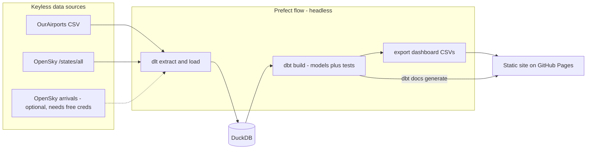

# Simple Airports Analysis v2 — Malaysia

A revival of [simple-airports-analysis](https://github.com/1bk/simple-airports-analysis)
(2020) rebuilt on a modern, fully open-source data stack. Same questions, new tools:

1. How many airports are there in Malaysia?
2. What is the distance between the airports in Malaysia?
3. How many flights are landing at Malaysian airports?
4. Which airport is the most congested?

The result is a **static site** — an interactive [marimo](https://marimo.io) dashboard
(running entirely in your browser via WebAssembly) with browsable
[dbt docs](https://docs.getdbt.com/docs/build/documentation) and table lineage at
`/dbt-docs/` — deployed to GitHub Pages on every push. No servers anywhere.

## What changed since v1

| | v1 (2020) | v2 (2026) | Why |
|---|---|---|---|
| Warehouse | Postgres (Docker) | [DuckDB](https://duckdb.org) | Zero infra, single file, no Docker |
| Extract/Load | Hand-rolled Python + scraping | [dlt](https://dlthub.com) | Declarative, schema-inferring EL |
| Orchestration | Luigi | [Prefect 3](https://prefect.io) | Runs headless as plain Python; dbt models surface as Prefect assets with lineage. (Prefect acquired Dagster in July 2026 — one ecosystem to learn) |
| Transformation | dbt | dbt-core 1.12 + [dbt-duckdb](https://github.com/duckdb/dbt-duckdb) | Still the right tool |
| Dashboard | Metabase (Docker) | [marimo](https://marimo.io) | Notebook-as-code in git, exports to static WASM — the dashboard itself is hostable on GitHub Pages |
| Packaging | requirements.txt | [uv](https://docs.astral.sh/uv/) | Fast, lockfile-native |
| CI/CD | Travis CI | GitHub Actions | Lint + pipeline on every push; Pages deploy |

## Architecture



- **Airports** come from the keyless [OurAirports](https://ourairports.com/data/) dataset.
- **Congestion** is a keyless proxy: a live snapshot of aircraft near each airport from
  OpenSky's anonymous API (fallbacks: [adsb.lol](https://api.adsb.lol), then a committed
  sample so the pipeline is always reproducible).
- **Arrivals history** (question 3) needs free OpenSky credentials. Without
  `OPENSKY_CLIENT_ID`/`OPENSKY_CLIENT_SECRET` set, the pipeline skips it gracefully and
  the dashboard says so.

## Quickstart

Requires [uv](https://docs.astral.sh/uv/) and `make`. No Docker, no databases to install.

```sh
make all        # uv sync + full pipeline: dlt -> DuckDB -> dbt build (+ tests)
make site       # build the static site into _site/ (dashboard + dbt docs)
python3 -m http.server --directory _site   # view it locally
```

Other targets: `make lint` (pre-commit: gitleaks, ruff, sqlfluff), `make clean`.

To develop the dashboard interactively: `uv run marimo edit dashboard/dashboard.py`.

## Project layout

```
pipelines/     dlt sources + Prefect flow (the entrypoint: python -m pipelines.flow)
dbt/           dbt project: staging views + marts, tests, docs
dashboard/     marimo notebook + public/ data baked for the WASM build
seeds/         committed sample aircraft snapshot (offline/CI fallback)
.github/       CI (lint + pipeline + site build) and Pages deploy workflows
```

## Future features

- **sqlmesh** as an alternative transformation engine alongside dbt
- **Semantic layer** (MetricFlow) over the marts
- **OpenSky arrivals** wired into CI via repository secrets
- **Custom domain** (1bk.dev) for the Pages site
- **AI/LLM layer**: natural-language questions over the warehouse via the dbt MCP server

## Credits

Original assessment project: [1bk/simple-airports-analysis](https://github.com/1bk/simple-airports-analysis).
Airport data © [OurAirports](https://ourairports.com/data/) (public domain).
Live aircraft data from the [OpenSky Network](https://opensky-network.org) research API.

MIT licensed.
